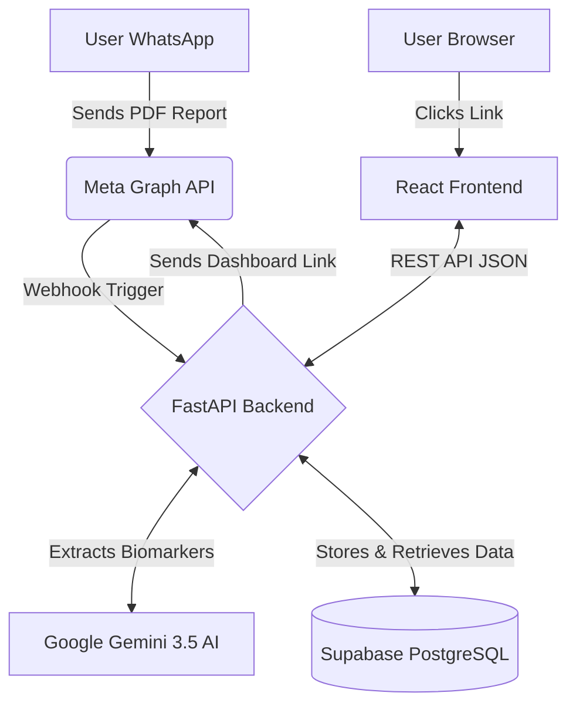

<div align="center">
  
  
  # Clariti Health
  **Understand your blood tests. In seconds.**
  
  [](https://clariti-ai-health-analytics.vercel.app/)
  [](https://clariti-backend.onrender.com)
  []()
  []()
  []()
  []()
</div>

---

## Overview

**Clariti Health** is an AI-powered healthcare assistant that transforms how patients interact with their medical data. Instead of trying to read raw PDF lab reports, users forward their blood test PDFs to a secure WhatsApp bot. 

Our Clinical AI extracts, standardizes, and analyzes the biomarkers, generating a personalized and interactive health dashboard.

<br/>

## System Architecture



<br/>

## Key Features

- **WhatsApp Native:** Zero friction. No apps to download. Process begins by forwarding a PDF in WhatsApp.
- **Clinical AI Extraction:** Uses Google Gemini 3.5 Flash to extract structured data from unstructured medical PDFs with high accuracy.
- **Interactive Dashboard:** A highly responsive UI built in React that tracks biomarker trends over time.
- **Historical Trend Tracking:** Automatically matches new test results with past data to generate visual trend graphs.
- **Executive AI Summary:** Generates a highly actionable health summary based on the latest biomarker data.

<br/>

## Tech Stack

**Frontend:**
- React (Vite)
- Recharts (Data Visualization)
- Vanilla CSS 
- Hosted on **Vercel**

**Backend:**
- Python 3 (FastAPI)
- Google GenAI SDK (Gemini 3.5 Flash)
- Meta Graph API (WhatsApp Business API)
- Hosted on **Render**

**Database:**
- PostgreSQL (Supabase)

<br/>

## Local Setup

### 1. Clone the repository
```bash
git clone https://github.com/Hardikkhanduja/Clariti-AI-Health-Analytics
cd Clariti-AI-Health-Analytics
```

### 2. Backend Setup
```bash
python -m venv venv
source venv/bin/activate  # On Windows use: venv\Scripts\activate

pip install -r requirements.txt

# Create .env file with your API keys
# (WHATSAPP_TOKEN, SUPABASE_URL, GEMINI_API_KEY, etc.)

uvicorn main:app --reload --port 8000
```

### 3. Frontend Setup
```bash
cd frontend/health-dashboard

npm install
npm run dev
```

<br/>

<div align="center">
  <i>Built by Hardik Khanduja</i>
</div>
